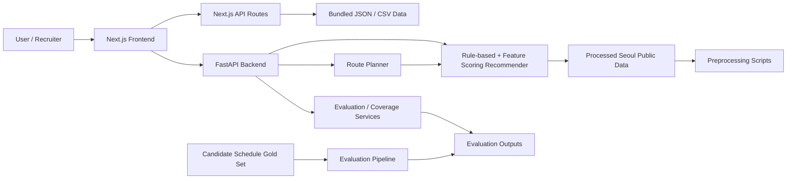

# 서울시 공공데이터와 실제 후보 일정 기반 유세 장소 추천 시스템

> A public-data-based campaign place recommender that suggests outreach locations, explains ranking reasons, and evaluates results against real candidate schedule Gold Sets.

[](https://election-campaign-coral.vercel.app)
[](./backend)
[](./frontend)
[](./docs/EVALUATION.md)

- Live Demo: https://election-campaign-coral.vercel.app
- Repository: https://github.com/junseoda/election_campaign
- 주요 문서: [Architecture](./docs/ARCHITECTURE.md) · [API](./docs/API.md) · [Data](./docs/DATA.md) · [Evaluation](./docs/EVALUATION.md) · [Troubleshooting](./docs/TROUBLESHOOTING.md)

## 프로젝트 개요

선거 유세 장소 선정은 단순히 지도를 검색하는 문제가 아니라, 시간대, 자치구, 유권자 특성, 장소 유형, 후보 일정 맥락을 함께 고려해야 하는 의사결정 문제입니다. 이 프로젝트는 서울시 공공데이터와 실제 후보 공개 일정표에서 구축한 Gold Set을 활용해 유세 장소를 추천하고, 추천 이유와 평가 결과를 함께 보여주는 웹 서비스입니다.

단순 장소 검색과 다른 점은 다음과 같습니다.

- 지하철, 공원, 전통시장, 노인여가복지시설 등 장소 유형별 후보군을 공공데이터에서 생성합니다.
- 시간대, 자치구, 대상 유권자, 장소 유형, 캠페인 문맥을 feature로 계산해 ranking합니다.
- 추천 결과에 score와 추천 이유를 함께 제공합니다.
- 실제 후보 일정 기반 Gold Set으로 Precision@K, Recall@K, NDCG@K와 후보군 coverage를 평가합니다.
- Next.js 데모와 FastAPI API를 분리해 시연과 재현이 모두 가능하도록 구성했습니다.

## 핵심 기능

| 기능 | 설명 | 관련 경로 |
| --- | --- | --- |
| 유세 장소 추천 | 시간대, 장소 유형, 대상 유권자, 자치구 조건에 맞는 추천 장소를 반환합니다. | `scripts/recommender.py`, `frontend/app/recommend/page.js` |
| 추천 이유 제공 | `time_match_score`, `age_match_score`, `context_score`, `facility_score` 등 feature 기반 근거를 제공합니다. | `scripts/recommender.py` |
| 유세 동선 추천 | 하루 유세 route template을 기준으로 여러 장소 추천을 묶어 동선을 구성합니다. | `scripts/route_planner.py`, `backend/services/route_service.py` |
| 평가 대시보드 | Gold Set 기반 평가 요약과 후보군 coverage를 API와 화면에서 확인합니다. | `backend/services/dashboard_service.py`, `frontend/app/evaluation/page.js` |
| 데이터 기반 ranking 실험 | raw candidate generation과 reranking을 분리해 모델 variant를 비교합니다. | `src/final_ranking_pipeline.py`, `output/final_ranking_model_comparison.csv` |

## 서비스 화면

현재 저장소에는 별도 `screenshots/` 폴더가 없습니다. 추후 다음 화면을 캡처해 추가할 예정입니다.

- 추천 조건 입력 및 추천 결과 화면
- 지도 기반 유세 동선 화면
- 평가 지표 대시보드
- 후보군 coverage / failure case 분석 화면

## 기술 스택

| 영역 | 기술 |
| --- | --- |
| Frontend | Next.js 15, React 19, React Leaflet, Leaflet |
| Backend | FastAPI, Uvicorn, Pydantic |
| Data / Evaluation | Python, Pandas, CSV, JSON, Precision@K, Recall@K, NDCG@K |
| Deployment | Vercel frontend, Render-compatible backend config |
| Tooling | npm, Python scripts, `.env.example`, `.vercelignore`, `render.yaml` |

## 시스템 구조



## 추천 로직 요약

### 1. Candidate generation

장소 유형별로 공공데이터 기반 후보군을 생성합니다.

- `subway`: 지하철 승하차 데이터 기반 유동량 후보
- `park`: 공원 면적, 시설 정보 기반 후보
- `market`: 전통시장 점포 수, 면적, 시장 유형 기반 후보
- `senior_friendly`: 노인여가복지시설 기반 후보

### 2. Feature-based scoring

후보별로 다음 feature를 계산하고 장소 유형별 weight를 적용합니다.

- `time_match_score`: 시간대와 장소 이용 맥락 적합성
- `age_match_score`: 대상 유권자와 장소 특성 적합성
- `context_score`: 자치구, 장소 유형, 생활권/상권 맥락
- `facility_score`: 시설 규모, 점포 수, 공원 면적 등 장소 자체 특성
- `interaction_score`: 시간대, 연령, 시설, 문맥을 결합한 보조 feature

### 3. Reranking

`src/final_ranking_pipeline.py`는 raw candidate를 고정한 뒤, district/place type/time/context/target voter/public-data feature를 추가해 reranking합니다. Gold Set의 실제 장소명과 주소는 scoring에 사용하지 않고 평가와 failure analysis에만 사용합니다.

### 4. Recommendation reason generation

추천 결과에는 score와 함께 feature별 근거 문장을 포함합니다. 예를 들어 시간대 유동량, 대상 유권자 적합성, 시설 규모, 자치구 일치 여부를 추천 이유로 제공합니다.

## 데이터 구성

| 데이터 | 설명 | 경로 |
| --- | --- | --- |
| 서울시 지하철 승하차 데이터 | 시간대별 유동량 기반 추천 | `data/processed/cleaned_subway.csv` |
| 서울시 공원 데이터 | 공원 규모와 시설 기반 추천 | `data/processed/cleaned_parks.csv` |
| 전통시장 데이터 | 생활권 중심 장소 추천 | `data/processed/cleaned_market.csv` |
| 노인여가복지시설 데이터 | 시니어 대상 유세 장소 추천 | `data/processed/cleaned_senior.csv` |
| 상권 유동인구 / 직장인구 / 생활인구 | 보조 context feature | `data/processed/cleaned_commercial_flow.csv`, `cleaned_worker_population.csv`, `cleaned_living_population.csv` |
| 후보 공개 일정 Gold Set | 실제 일정 기반 평가 query | `gold set수작업/`, `output/gold_set_*.csv` |
| 최종 평가 산출물 | 모델 비교, coverage, failure case, explainability | `output/final_*.csv`, `output/final_evaluation_summary.md` |

원본 대용량 데이터와 민감 가능성이 있는 원본 자료는 공개/배포 전 별도 점검이 필요합니다. 이 README는 저장소에서 확인 가능한 processed/output 파일만 설명합니다.

## 평가 방법

평가는 후보 공개 일정 기반 Gold Set을 query로 사용하고, 추천 결과와 정답 장소를 비교합니다.

| Metric | 의미 |
| --- | --- |
| Precision@K | Top K 추천 중 정답 또는 관련 장소 비율 |
| Recall@K | Gold Set 정답이 Top K 안에 포함되는 비율 |
| NDCG@K | 관련 장소가 상위에 배치되었는지 반영한 ranking 품질 |
| Raw Recall@50 | raw candidate generation 단계에서 정답 후보가 Top 50 안에 존재하는지 |
| Composite Similarity | 자치구, 장소 유형, 시간대, 캠페인 문맥, 대상 유권자 유사도를 결합한 보조 평가 |

저장소의 `output/experiments_optimized/model_comparison_optimized.csv` 기준 주요 결과는 다음과 같습니다.

| Model | P@1 | R@10 | NDCG@10 | 비고 |
| --- | ---: | ---: | ---: | --- |
| baseline | 0.0286 | 0.2714 | 0.1105 | 기존 rule-based ranking |
| proposed | 0.0429 | 0.2714 | 0.1334 | district/place/time/context feature 결합 |
| optimized_proposed | 0.0714 | 0.2714 | 0.1682 | weight search 기반 reranking |

최종 `output/final_evaluation_summary.md` 기준으로는 raw candidate generation coverage의 한계도 함께 분석되어 있습니다. 예를 들어 raw Top50 안에 정답 유사 후보가 없는 query는 reranking만으로 해결할 수 없는 candidate generation gap으로 분리했습니다.

## 실행 방법

### 1. Backend 실행

```bash
cd election_campaign
python -m venv .venv
.venv\Scripts\activate
pip install -r backend/requirements.txt
uvicorn backend.main:app --reload
```

기본 API 주소는 `http://127.0.0.1:8000`입니다.

### 2. Frontend 실행

```bash
cd election_campaign/frontend
npm install
npm run dev
```

기본 프론트 주소는 `http://localhost:3000`입니다. 프론트엔드는 기본적으로 번들된 JSON/CSV와 Next.js API routes를 사용하므로, 별도 FastAPI 서버 없이도 주요 데모 화면을 확인할 수 있습니다.

### 3. Frontend build / QA

```bash
cd election_campaign/frontend
npm run qa
npm run build
```

### 4. 평가 파이프라인 재실행

```bash
cd election_campaign
py src/final_ranking_pipeline.py \
  --gold output/gold_set_evaluation_queries.csv \
  --raw output/raw_baseline_recommendations.csv \
  --output_dir output \
  --top_k 10 \
  --search_mode random \
  --n_trials 80 \
  --random_state 42
```

Windows에서 `py` 대신 `python`을 사용할 수 있으면 동일하게 실행할 수 있습니다.

## API 요약

| Method | Endpoint | 설명 |
| --- | --- | --- |
| GET | `/health` | API 상태 확인 |
| POST | `/recommend` | 유세 장소 추천 |
| POST | `/route` | template 기반 유세 동선 추천 |
| GET | `/optimized/queries` | 평가 query 목록 |
| GET | `/optimized/recommendations` | 최적화 추천 결과 |
| GET | `/evaluation/dashboard` | 평가 대시보드 데이터 |
| GET | `/coverage/dashboard` | 후보군 coverage 데이터 |
| GET | `/route/options` | 동선 추천 옵션 |
| POST | `/route/recommend` | 조건 기반 동선 추천 |
| GET | `/route/sample` | 샘플 동선 |

자세한 요청/응답 예시는 [docs/API.md](./docs/API.md)를 참고하세요.

## 폴더 구조

```text
election_campaign/
  backend/
    main.py
    requirements.txt
    scripts/
      recommender.py
      route_planner.py
      message_rules.py
    services/
      dashboard_service.py
      route_service.py
  frontend/
    app/
      api/
      components/
      evaluation/
      recommend/
      route/
    public/data/
    package.json
  data/processed/
  docs/
  gold set수작업/
  output/
  scripts/
  src/
    final_ranking_pipeline.py
    evaluate_recommendations.py
    optimize_reranking_weights.py
  render.yaml
```

## 트러블슈팅

- `ModuleNotFoundError`: 프로젝트 루트에서 실행하거나 `uvicorn backend.main:app --reload` 형식을 사용합니다.
- `NEXT_PUBLIC_API_BASE_URL` 문제: 프론트는 값이 없으면 로컬/정적 데이터를 사용합니다. 운영 환경에서 localhost URL을 설정하지 않습니다.
- Kakao 지도 키 문제: `frontend/.env.example`을 참고해 `NEXT_PUBLIC_KAKAO_MAP_API_KEY`를 설정합니다.
- 평가 결과가 달라지는 경우: `--random_state 42`를 고정하고 동일한 Gold/raw 파일을 사용합니다.

자세한 내용은 [docs/TROUBLESHOOTING.md](./docs/TROUBLESHOOTING.md)를 참고하세요.

## 프로젝트에서 배운 점

- 추천 시스템은 모델 자체보다 candidate generation, 평가 기준, leakage 방지가 함께 설계되어야 재현 가능한 결과가 됩니다.
- 실제 공공데이터와 공개 일정 데이터를 연결하면 단순 지도 검색보다 의사결정 맥락이 풍부한 추천 문제로 확장할 수 있습니다.
- exact place hit만으로는 유세 장소 추천의 유사성을 충분히 설명하기 어려워, 자치구/장소 유형/시간대/문맥 기반 보조 평가가 필요했습니다.
- 웹 서비스 형태로 구현하면 추천 결과뿐 아니라 추천 이유와 평가 한계를 함께 보여줄 수 있습니다.

## 향후 개선 방향

- screenshots 추가 및 실제 사용자 흐름 기반 데모 문서 보강
- 후보군 생성 단계의 coverage 개선
- 지도 좌표 품질과 Kakao/Leaflet 경로 표현 안정화
- 실제 캠페인 운영자 또는 도메인 전문가 검증 추가
- 공공데이터 업데이트 자동화와 모델 실험 재현 스크립트 정리
