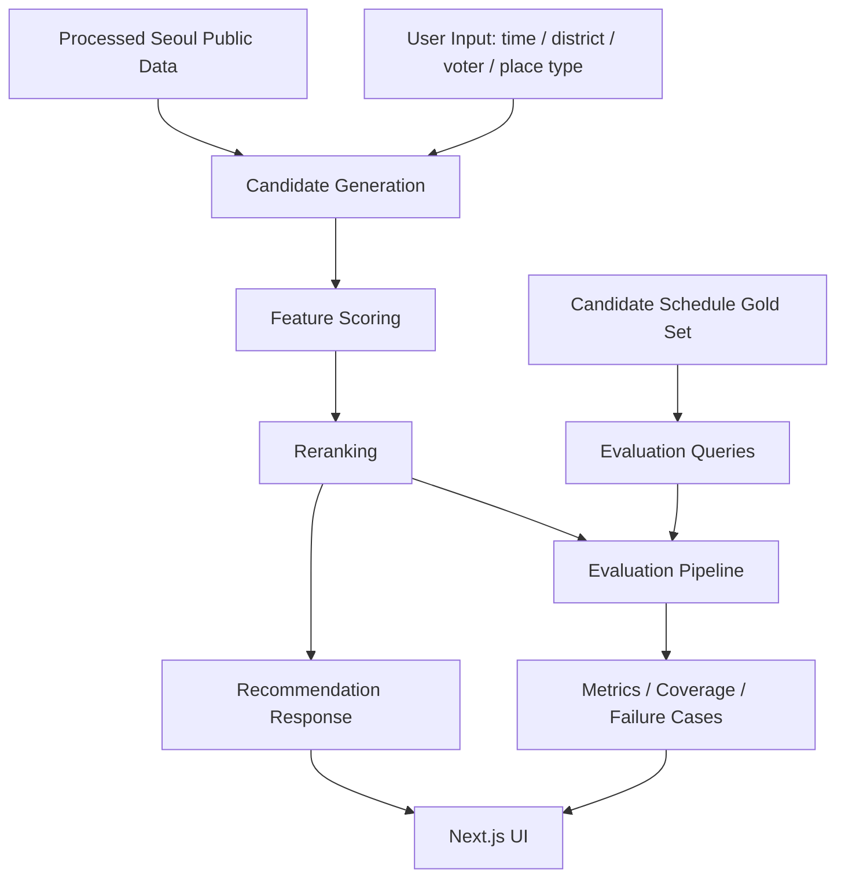

# Architecture

> System architecture for the Seoul public-data campaign place recommender.

## 목적

이 프로젝트는 서울시 공공데이터와 후보 공개 일정 Gold Set을 활용해 유세 장소를 추천하고, 추천 결과를 웹 화면과 API, 평가 산출물로 확인할 수 있게 구성한 MVP입니다.

핵심 설계 방향은 다음과 같습니다.

- 설명 가능한 rule-based + feature scoring 구조
- raw candidate generation과 reranking의 분리
- 추천 결과와 평가 결과를 같은 저장소에서 재현
- 프론트엔드 데모와 FastAPI 백엔드의 느슨한 결합

## High-level Flow

## Frontend

프론트엔드는 `frontend/` 아래의 Next.js 앱입니다.

- `frontend/app/page.js`: 메인 진입 화면
- `frontend/app/recommend/page.js`: 장소 추천 화면
- `frontend/app/route/page.js`: 동선 추천 화면
- `frontend/app/evaluation/page.js`: 평가 결과 화면
- `frontend/app/api/*`: 정적 JSON/CSV와 백엔드 연동을 함께 지원하는 API routes
- `frontend/app/components/`: 추천, 지도, 동선 UI 컴포넌트

프론트엔드는 기본적으로 `frontend/public/data/`와 Next.js API routes를 통해 데모 데이터를 읽을 수 있습니다. `API_BASE_URL` 또는 `NEXT_PUBLIC_API_BASE_URL`을 설정하면 FastAPI 백엔드와 연동할 수 있습니다.

## Backend

백엔드는 `backend/main.py`의 FastAPI 앱입니다.

주요 계층은 다음과 같습니다.

- API layer: 요청/응답 모델, validation, CORS, endpoint 정의
- Recommendation layer: `scripts/recommender.py`
- Route layer: `scripts/route_planner.py`, `backend/services/route_service.py`
- Dashboard layer: `backend/services/dashboard_service.py`
- District validation: `backend/district_utils.py`

## Recommendation Layer

`scripts/recommender.py`는 장소 유형별 후보군을 로드하고 feature score를 계산합니다.

| Place type | 주요 데이터 | 주요 scoring 관점 |
| --- | --- | --- |
| `subway` | `cleaned_subway.csv` | 시간대 유동량, 역 노출도 |
| `park` | `cleaned_parks.csv` | 공원 면적, 시설 텍스트, 지역 맥락 |
| `market` | `cleaned_market.csv` | 점포 수, 연면적, 시장 유형 |
| `senior_friendly` | `cleaned_senior.csv` | 시설 완성도, 복지/시니어 맥락 |

공통 scoring feature는 `time_match_score`, `age_match_score`, `context_score`, `facility_score`, `interaction_score`입니다.

## Route Layer

동선 추천은 단일 추천기를 여러 번 호출해 하루 일정 형태로 묶습니다.

- `default`: 출근 시간대 지하철, 공원, 시니어 시설, 퇴근 시간대 지하철
- `neighborhood_focus`: 시장, 공원, 시니어 시설, 지하철을 묶은 생활권 중심 route

`backend/services/route_service.py`는 실제 route 옵션, 샘플 route, 프론트용 응답 가공을 담당합니다.

## Evaluation Layer

평가는 `src/`와 `output/` 중심으로 구성됩니다.

- `src/build_gold_eval_set.py`: Gold Set 평가 query 생성
- `src/generate_raw_baseline_recommendations.py`: raw baseline 후보군 생성
- `src/run_model_experiments.py`: 모델 variant 비교
- `src/optimize_reranking_weights.py`: reranking weight 탐색
- `src/final_ranking_pipeline.py`: 최종 ranking, coverage, failure analysis 통합

평가 산출물은 `output/final_*.csv`와 `output/final_evaluation_summary.md`에 저장됩니다.

## Deployment

- Frontend: Vercel 배포를 기준으로 구성되어 있습니다.
- Backend: `render.yaml`과 `uvicorn backend.main:app` 실행 경로를 기준으로 배포 가능합니다.
- 환경변수: `frontend/.env.example`을 기준으로 설정합니다. 브라우저에 노출되는 `NEXT_PUBLIC_*` 값에는 서버 secret을 넣지 않습니다.
